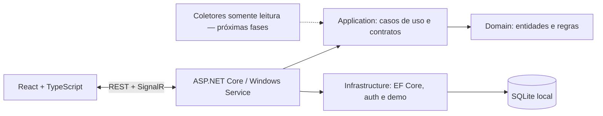

# Protheus Pulse

Monitoramento técnico local, seguro e independente para instalações TOTVS Protheus em Windows Server.

> **Estado do projeto:** Fase 1 concluída e Fase 2 em andamento. A fundação, o banco local, a API autenticada, o dashboard, o serviço Windows, o SignalR, o modo demonstração e o cadastro manual de instalações estão funcionais. Importação e descoberta segura são os próximos incrementos; coletores reais entram na Fase 3.


## Por que existe

O Pulse consolida estado atual, causa, evidência sanitizada e histórico técnico sem depender de nuvem. A arquitetura é somente leitura: o produto não inicia ou para serviços, não executa binários Protheus e não altera INI, RPO, banco ou arquivos monitorados.

Este é um produto independente, não oficial e não afiliado à TOTVS. O repositório não contém binários, bibliotecas, documentação fechada, logotipos ou dados reais de clientes.

## O que já funciona

- Host ASP.NET Core .NET 8 preparado para executar como Windows Service.
- React, Vite e TypeScript compilados e servidos pelo mesmo processo.
- SQLite com EF Core e migration inicial para todo o modelo mínimo.
- Autenticação local JWT e perfis `Administrator`, `Operator` e `Viewer`.
- Hash de senha PBKDF2-SHA256 com salt aleatório e 210 mil iterações.
- Bind padrão em `127.0.0.1:5058`, limites de requisição e cabeçalhos de segurança.
- Dashboard responsivo em português, temas claro/escuro e SignalR.
- Health checks em `/health/live` e `/health/ready`.
- OpenAPI/Swagger em desenvolvimento e no modo demo.
- Modo `--demo` persistido, com dois ambientes, alerta de memória, job atrasado, TLS próximo do vencimento, erros agrupados e incidente que abre e se resolve.
- Serilog com rotação diária, limite de tamanho e retenção de 14 arquivos.
- Testes xUnit, Vitest e Playwright; CI reproduzível em `windows-latest`.
- Cadastro manual de instalações e componentes com autorização administrativa, validação e auditoria sanitizada.

## Executar a demonstração

Pré-requisitos: SDK .NET 8 e Node.js 24 ou versão compatível com Vite 8.

```powershell
git clone <url-do-repositorio>
Set-Location protheus-pulse
npm ci
npm run ui:build
dotnet restore ProtheusPulse.sln
dotnet run --project .\src\ProtheusPulse.Service -- --demo
```

Abra [http://127.0.0.1:5058](http://127.0.0.1:5058) e use:

- usuário: `demo.admin`
- senha: `PulseDemo!2026`

Essas credenciais existem **somente** quando `--demo` está ativo. Dados simulados são marcados no banco e na interface.

Para uma execução que não seja demo, defina uma chave JWT de pelo menos 32 caracteres:

```powershell
$env:PULSE_JWT_SIGNING_KEY = '<segredo-aleatorio-com-pelo-menos-32-caracteres>'
dotnet run --project .\src\ProtheusPulse.Service
```

Na primeira abertura, a API oferece a criação do administrador inicial. Nunca use a chave demonstrativa em produção.

## Arquitetura



O domínio não referencia APIs do Windows. Coletores implementam `IProbeCollector`, recebem `CancellationToken` e devolvem um estado padronizado (`Healthy`, `Warning`, `Critical`, `Unknown` ou `Maintenance`). A regra de agregação impede que um componente seja saudável quando uma verificação obrigatória está crítica.

Veja [Arquitetura e decisões](docs/ARCHITECTURE.md) e o [modelo de ameaças](docs/THREAT-MODEL.md).

## Estrutura

```text
src/
  ProtheusPulse.Domain/          entidades e regras puras
  ProtheusPulse.Application/     contratos e modelos de consulta
  ProtheusPulse.Infrastructure/  SQLite, consultas, senha e dados demo
  ProtheusPulse.Service/         host web/Windows Service, API e SignalR
  protheus-pulse-ui/             React/Vite/TypeScript
tests/
  ProtheusPulse.UnitTests/
  ProtheusPulse.IntegrationTests/
  protheus-pulse-ui-tests/
samples/                         somente dados sintéticos
docs/                            arquitetura, operação e segurança
installer/                       reservado à Fase 5
scripts/                         build e execução local
```

## Verificar o projeto

```powershell
dotnet build ProtheusPulse.sln --configuration Release
dotnet test ProtheusPulse.sln --configuration Release --no-build
npm run ui:test
npm run ui:build
npx playwright install chromium
npm run ui:e2e
npm audit --audit-level=moderate
```

## Roadmap verificável

- [x] Fase 1 — fundação, banco, serviço, API, frontend e demo.
- [ ] Fase 2 — cadastro manual concluído; importação, descoberta segura e parser INI sanitizado pendentes.
- [ ] Fase 3 — coletores de serviço/processo, TCP/HTTP, arquivo/disco e logs incrementais.
- [ ] Fase 4 — motor completo de regras, notificações, retenção e agregação.
- [ ] Fase 5 — heartbeats autenticados, instalador Inno Setup, PowerShell e hardening final.

Endpoints ainda pertencentes a fases futuras respondem `501 Not Implemented` de forma explícita; não simulam sucesso.

## Documentação

- [Instalação no Windows Server](docs/INSTALLATION.md)
- [Atualização e rollback](docs/UPDATE-ROLLBACK.md)
- [Cadastro de instalações](docs/ADDING-INSTALLATIONS.md)
- [Privacidade e retenção](docs/PRIVACY-RETENTION.md)
- [Threat model](docs/THREAT-MODEL.md)
- [Como contribuir](CONTRIBUTING.md)
- [Política de segurança](SECURITY.md)

Licenciado sob a [MIT](LICENSE).
