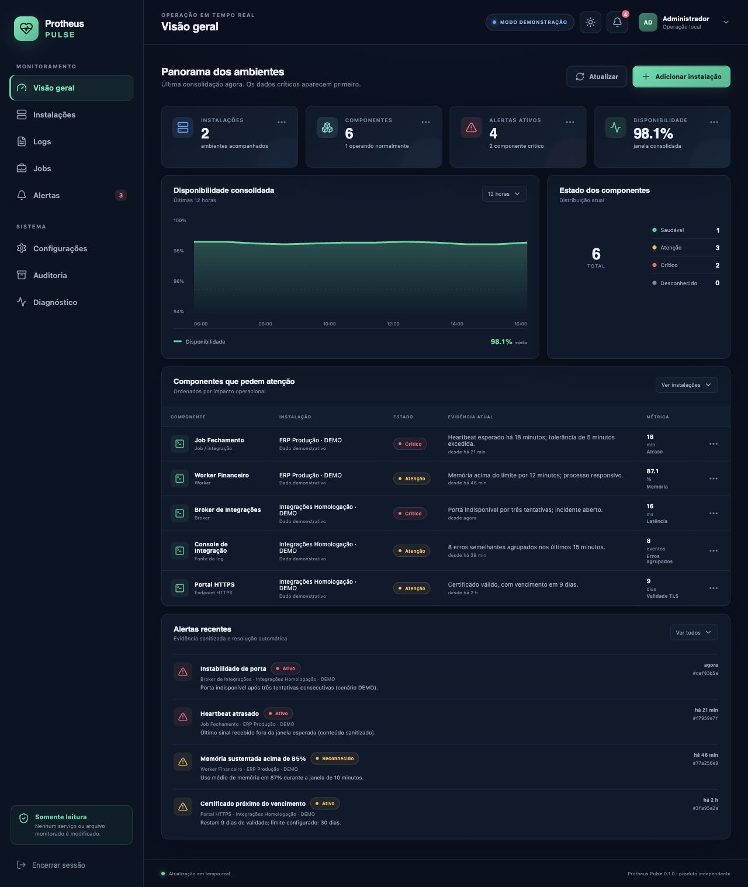
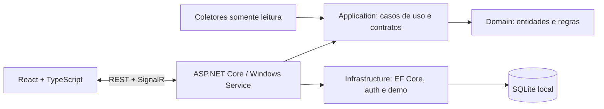

# Protheus Pulse

Monitoramento técnico local, seguro e independente para instalações TOTVS Protheus em Windows Server.

> **Versão estável:** 1.0.0. O Protheus Pulse está pronto para implantação e operação, com configuração pelo painel local, descoberta assistida, coletores, alertas, heartbeats, retenção e instalador para Windows.



## Visão geral

O Pulse consolida estado atual, causa, evidência sanitizada e histórico técnico sem depender de nuvem. A arquitetura é somente leitura: o produto não inicia ou para serviços, não executa binários Protheus e não altera INI, RPO, banco ou arquivos monitorados.

Este é um produto independente, não oficial e não afiliado à TOTVS. O repositório público contém somente código-fonte, documentação, exemplos sintéticos e automação de build; não contém bibliotecas proprietárias, documentação restrita, logotipos ou dados reais de clientes.

## Recursos

- Host ASP.NET Core .NET 8 preparado para executar como Windows Service.
- React, Vite e TypeScript compilados e servidos pelo mesmo processo.
- SQLite com EF Core e migration inicial para todo o modelo mínimo.
- Autenticação local JWT e perfis `Administrator`, `Operator` e `Viewer`.
- Hash de senha PBKDF2-SHA256 com salt aleatório e 210 mil iterações.
- Bind padrão em `127.0.0.1:5058`, limites de requisição e cabeçalhos de segurança.
- Dashboard responsivo em português, temas claro/escuro e SignalR.
- Health checks em `/health/live` e `/health/ready`.
- OpenAPI/Swagger no ambiente de desenvolvimento local e no modo demonstração.
- Modo `--demo` persistido, com dois ambientes, alerta de memória, job atrasado, TLS próximo do vencimento, erros agrupados e incidente que abre e se resolve.
- Serilog com rotação diária, limite de tamanho e retenção de 14 arquivos.
- Validação automatizada com xUnit, Vitest e Playwright em `windows-latest`.
- Cadastro, edição e remoção de instalações pelo painel local, incluindo serviços Windows, executável, INI, logs, TCP e HTTP/HTTPS.
- Descoberta assistida de serviços e arquivos e coleta imediata pelo navegador, sem PowerShell na configuração operacional.
- Importação JSON/YAML com prévia, schema estrito e confirmação explícita.
- Descoberta de serviços, caminhos e INI em modo somente leitura, com limites e mascaramento de segredos.
- Agendador com concorrência e timeout limitados, execução manual administrativa e atualização por SignalR.
- Coletores somente leitura de serviço/processo Windows, TCP, HTTP/TLS, arquivo, disco e logs incrementais sanitizados.
- Regras automáticas/customizadas, falhas consecutivas, cooldown, reconhecimento, resolução e janelas de manutenção.
- Webhooks HTTPS com configuração protegida e payload mínimo; retenção automática com agregação horária.
- Heartbeats com token aleatório exibido uma vez, somente hash no banco, rotação, janela operacional e rate limit.
- Serviço Windows sob `LocalService`, chave JWT em arquivo restrito, DPAPI, ACLs mínimas e recuperação automática.
- `setup.exe` self-contained em Inno Setup, sem PowerShell no fluxo normal, com SHA-256, serviço `LocalService` e health check pós-instalação.

## Instalação

Para uso em Windows Server, utilize `protheus-pulse-1.0.0-win-x64-setup.exe` junto do arquivo `.sha256` correspondente. O instalador registra o serviço, gera a chave JWT local, preserva os dados entre atualizações e valida a disponibilidade ao concluir.

Consulte [Instalação no Windows Server](docs/INSTALLATION.md) para pré-requisitos, verificação do pacote, primeiro acesso e permissões. Organizações que compilam o próprio pacote encontram o processo reproduzível em [installer/README.md](installer/README.md).

## Avaliação local com dados sintéticos

Pré-requisitos: SDK .NET 8 e Node.js 24 ou versão compatível com Vite 8.

```powershell
git clone https://github.com/jeanvga/protheus-pulse.git
Set-Location protheus-pulse
npm ci
npm run ui:build
dotnet restore ProtheusPulse.sln
dotnet run --project .\src\ProtheusPulse.Service -- --demo
```

Abra [http://127.0.0.1:5058](http://127.0.0.1:5058) e use:

- usuário: `demo.admin`
- senha: `PulseDemo!2026`

Essas credenciais existem **somente** quando `--demo` está ativo. Dados simulados são marcados no banco e na interface.

Para executar o código-fonte fora do modo demonstração, defina uma chave JWT de pelo menos 32 caracteres:

```powershell
$env:PULSE_JWT_SIGNING_KEY = '<segredo-aleatorio-com-pelo-menos-32-caracteres>'
dotnet run --project .\src\ProtheusPulse.Service
```

Na instalação Windows, o `setup.exe` gera um arquivo secreto e define `PULSE_JWT_SIGNING_KEY_FILE`; não é necessário expor a chave no ambiente interativo. Na primeira abertura, a API oferece a criação do administrador inicial. Nunca use a chave demonstrativa em produção.

## Arquitetura



O domínio não referencia APIs do Windows. Coletores implementam `IProbeCollector`, recebem `CancellationToken` e devolvem um estado padronizado (`Healthy`, `Warning`, `Critical`, `Unknown` ou `Maintenance`). A regra de agregação impede que um componente seja saudável quando uma verificação obrigatória está crítica.

Veja [Arquitetura e decisões](docs/ARCHITECTURE.md) e o [modelo de ameaças](docs/THREAT-MODEL.md).

## Estrutura

```text
src/
  ProtheusPulse.Domain/          entidades e regras puras
  ProtheusPulse.Application/     contratos e modelos de consulta
  ProtheusPulse.Infrastructure/  SQLite, consultas, senha e dados demo
  ProtheusPulse.Service/         host web/Windows Service, API e SignalR
  protheus-pulse-ui/             React/Vite/TypeScript
tests/
  ProtheusPulse.UnitTests/
  ProtheusPulse.IntegrationTests/
  protheus-pulse-ui-tests/
samples/                         somente dados sintéticos
docs/                            arquitetura, operação e segurança
installer/                       fonte reproduzível do Inno Setup
scripts/                         build, release, instalação e execução local
```

## Validação para contribuidores

```powershell
dotnet build ProtheusPulse.sln --configuration Release
dotnet test ProtheusPulse.sln --configuration Release --no-build
npm run ui:test
npm run ui:build
npx playwright install chromium
npm run ui:e2e
npm audit --audit-level=moderate
```

## Documentação

- [Instalação no Windows Server](docs/INSTALLATION.md)
- [Atualização e rollback](docs/UPDATE-ROLLBACK.md)
- [Cadastro de instalações](docs/ADDING-INSTALLATIONS.md)
- [Coletores e ciclo de monitoramento](docs/MONITORING.md)
- [Alertas, manutenção e notificações](docs/ALERTING.md)
- [Heartbeats autenticados](docs/HEARTBEATS.md)
- [Privacidade e retenção](docs/PRIVACY-RETENTION.md)
- [Checklist de implantação](docs/DEPLOYMENT-CHECKLIST.md)
- [Threat model](docs/THREAT-MODEL.md)
- [Como contribuir](CONTRIBUTING.md)
- [Política de segurança](SECURITY.md)

Licenciado sob a [MIT](LICENSE).
