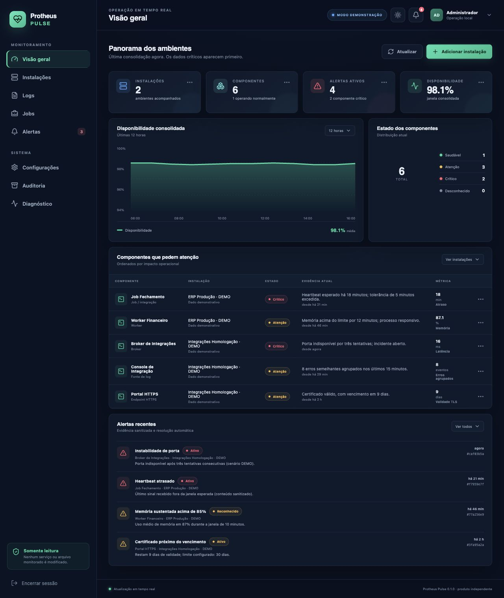

# Protheus Pulse

Painel local para monitorar e operar instalações TOTVS Protheus em Windows Server.

Você instala em um servidor, cadastra seus ambientes e acompanha em uma tela só se cada serviço está no ar, se as portas respondem, se o certificado vence, se o disco está acabando e o que os logs mostraram. Também dá para iniciar, reiniciar e parar os serviços pelo painel.

Roda sozinho no seu servidor. Não usa nuvem, não manda dado para fora e não altera INI, RPO nem banco do Protheus.

Feito pela [Pullsia Tecnologia](https://pullsia.com.br), que trabalha com [desenvolvimento ADVPL para Protheus](https://pullsia.com.br/desenvolvimento-advpl-protheus).

> Produto independente, sem vínculo ou afiliação com a TOTVS.



## Funcionalidades

**Monitoramento**

- Verifica serviço Windows, processo, porta TCP, HTTP/HTTPS, validade de TLS, arquivos, espaço em disco e logs.
- Cada ambiente aparece como Saudável, Atenção, Crítico, Desconhecido ou Em manutenção.
- Atualização em tempo real na tela, sem precisar recarregar a página.
- Página de logs com busca por mensagem, componente e ambiente, e filtro por severidade.

**Alertas**

- Regras prontas e regras próprias, com tolerância a falhas seguidas e cooldown para não encher de aviso repetido.
- Reconhecer, resolver e abrir janela de manutenção para silenciar alertas planejados.
- Envio por webhook HTTPS.

**Operação dos serviços**

- Iniciar, reiniciar e parar serviços Windows direto do painel, com confirmação. Os botões respeitam o estado atual: serviço no ar não pode ser iniciado, serviço parado não pode ser parado.
- **Modo manutenção:** para todos os ambientes monitorados de uma vez e suspende os alertas. Ao encerrar, sobe tudo de volta.
- **Instalação exclusiva:** marque um ambiente como exclusivo e, ao entrar em manutenção, ele é reiniciado (derrubando as sessões conectadas) e fica sendo o único no ar — para compilar e salvar configuração sem ninguém dentro.
- **Auto-start:** um watchdog religa sozinho os serviços que caírem. Se um serviço não sobe por erro de configuração ou licença, ele desiste depois de algumas tentativas em vez de ficar tentando para sempre.
- Toda ação fica registrada em auditoria, com quem fez e quando.

**Segurança**

- Login local com perfis Administrator, Operator e Viewer. Só Administrator mexe em serviço.
- Senha com PBKDF2-SHA256 e 210 mil iterações.
- Escuta só em `127.0.0.1:5058` por padrão, com limite de requisições e cabeçalhos de segurança.
- Coleta é somente leitura: o Pulse não executa binário do Protheus nem edita arquivo monitorado.
- Segredos são mascarados nos logs e nas evidências.

**Instalação**

- Um único `setup.exe`, sem precisar abrir PowerShell.
- Registra o serviço Windows, gera a chave de assinatura e configura recuperação automática.
- Atualização preserva o banco e as configurações.

## Baixar e instalar (uso normal)

1. Vá em **[Releases](https://github.com/jeanvga/protheus-pulse/releases/latest)**.
2. Baixe `protheus-pulse-<versão>-win-x64-setup.exe` e o `.sha256` do lado.
3. No servidor, confira se o arquivo não veio corrompido:

   ```powershell
   Get-FileHash .\protheus-pulse-1.2.0-win-x64-setup.exe -Algorithm SHA256
   ```

   O resultado tem que ser igual ao que está dentro do arquivo `.sha256`.
4. Execute o instalador como administrador e siga o assistente.
5. Abra <http://127.0.0.1:5058> no servidor e crie o usuário administrador na primeira tela.

O instalador não tem assinatura digital paga, então o Windows SmartScreen mostra um aviso. Depois de conferir o SHA-256, clique em **Mais informações → Executar assim mesmo**.

Passo a passo completo, pré-requisitos e permissões: [docs/INSTALLATION.md](docs/INSTALLATION.md).

## Testar sem instalar (modo demonstração)

Se você só quer ver como é, dá para rodar o código com dados fictícios. Precisa de [.NET 8 SDK](https://dotnet.microsoft.com/download/dotnet/8.0) e [Node.js 24](https://nodejs.org/).

```powershell
git clone https://github.com/jeanvga/protheus-pulse.git
cd protheus-pulse
npm ci
npm run ui:build
dotnet run --project .\src\ProtheusPulse.Service -- --demo
```

Abra <http://127.0.0.1:5058> e entre com:

- usuário: `demo.admin`
- senha: `PulseDemo!2026`

Esse usuário só existe com `--demo` ligado, e os dados são todos simulados e marcados como tal na tela. Nunca use isso em produção.

Para rodar o código com dados reais em vez do modo demo, defina uma chave de assinatura de pelo menos 32 caracteres antes:

```powershell
$env:PULSE_JWT_SIGNING_KEY = '<segredo-aleatorio-com-pelo-menos-32-caracteres>'
dotnet run --project .\src\ProtheusPulse.Service
```

Quando você instala pelo `setup.exe`, isso é feito automaticamente e você não precisa mexer em variável de ambiente.

## Como é feito

Backend em ASP.NET Core (.NET 8) rodando como Windows Service, frontend em React + TypeScript servido pelo mesmo processo, e SQLite local para os dados. Tudo empacotado em um executável self-contained.

```text
src/
  ProtheusPulse.Domain/          regras de negócio
  ProtheusPulse.Application/     casos de uso e contratos
  ProtheusPulse.Infrastructure/  banco, autenticação e dados demo
  ProtheusPulse.Service/         API, SignalR e host do Windows Service
  protheus-pulse-ui/             interface React
tests/                           testes unitários, integração e end-to-end
docs/                            documentação
installer/                       fonte do instalador Inno Setup
scripts/                         build e instalação
```

Detalhes em [docs/ARCHITECTURE.md](docs/ARCHITECTURE.md).

## Compilar seu próprio instalador

Em uma máquina Windows com .NET 8, Node.js 24 e [Inno Setup 6.6+](https://jrsoftware.org/isinfo.php):

```powershell
.\scripts\build-release.ps1
```

O `setup.exe`, o ZIP e os arquivos `.sha256` saem em `artifacts\release`. Veja [installer/README.md](installer/README.md).

## Contribuindo

Antes de abrir um pull request, rode:

```powershell
dotnet build ProtheusPulse.sln --configuration Release
dotnet test ProtheusPulse.sln --configuration Release --no-build
npm run ui:test
npm run ui:build
npx playwright install chromium
npm run ui:e2e
```

Leia [CONTRIBUTING.md](CONTRIBUTING.md). Para reportar falha de segurança, siga [SECURITY.md](SECURITY.md) — não abra issue pública.

## Documentação

| Assunto | Onde |
| --- | --- |
| Instalar no Windows Server | [docs/INSTALLATION.md](docs/INSTALLATION.md) |
| Atualizar e voltar atrás | [docs/UPDATE-ROLLBACK.md](docs/UPDATE-ROLLBACK.md) |
| Cadastrar seus ambientes | [docs/ADDING-INSTALLATIONS.md](docs/ADDING-INSTALLATIONS.md) |
| Como o monitoramento funciona | [docs/MONITORING.md](docs/MONITORING.md) |
| Alertas e manutenção | [docs/ALERTING.md](docs/ALERTING.md) |
| Heartbeats | [docs/HEARTBEATS.md](docs/HEARTBEATS.md) |
| Privacidade e retenção de dados | [docs/PRIVACY-RETENTION.md](docs/PRIVACY-RETENTION.md) |
| Checklist de implantação | [docs/DEPLOYMENT-CHECKLIST.md](docs/DEPLOYMENT-CHECKLIST.md) |
| Arquitetura | [docs/ARCHITECTURE.md](docs/ARCHITECTURE.md) |
| Modelo de ameaças | [docs/THREAT-MODEL.md](docs/THREAT-MODEL.md) |
| Histórico de versões | [CHANGELOG.md](CHANGELOG.md) |

## Quem mantém

O Protheus Pulse é mantido pela **[Pullsia Tecnologia](https://pullsia.com.br)**.

- [Desenvolvimento ADVPL para Protheus](https://pullsia.com.br/desenvolvimento-advpl-protheus) — customizações MVC, pontos de entrada, relatórios, integrações via API REST e migração de ADVPL para TLPP.
- [Pullsia KPI](https://kpi.pullsia.com.br) — indicadores financeiros e comerciais do ERP em tempo real, com drill-down até o documento e chat com IA.
- Dúvida, ideia ou bug: abra uma [issue](https://github.com/jeanvga/protheus-pulse/issues). Assunto comercial: [contato@pullsia.com.br](mailto:contato@pullsia.com.br).

Licenciado sob [MIT](LICENSE).
